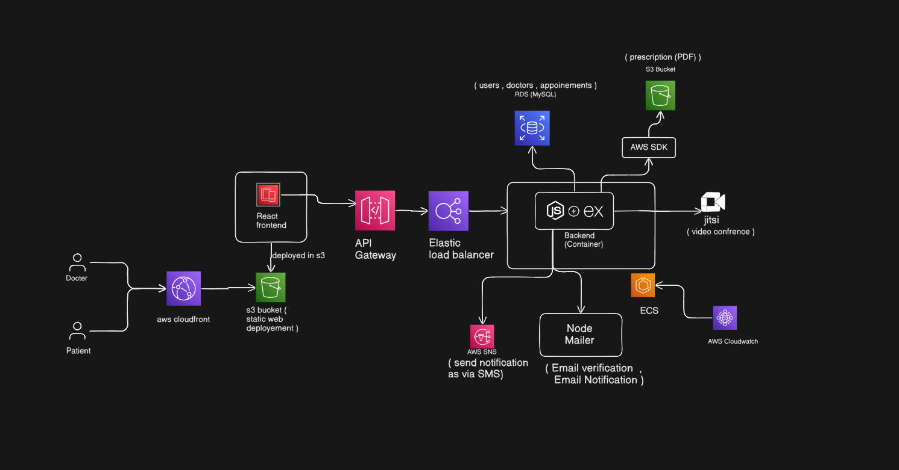

# Clinic Management System

A comprehensive, production-ready Cloud Clinic Management System with role-based dashboards (Patient/Doctor), video consultations, dynamically generated PDF prescriptions, and scalable cloud infrastructure.

## Architecture



## Overview

The platform provides a seamless digital healthcare experience where patients can book appointments with doctors based on specialization, participate in secure video sessions, and manage their health records and prescriptions securely.

The repository is modularized into two main services:
- **[Frontend](./frontend/)**: A responsive React (Vite) application utilizing React Router and a customizable CSS design system.
- **[Backend](./backend/)**: A robust Express.js API connecting to MySQL (Sequelize ORM) and AWS Services (S3, SES, SNS) for cloud storage and communication.

## Key Features

### Users & Authentication
- **Role-based Access**: Dedicated features for `Patient` and `Doctor` profile types.
- **Secure Authentication**: JWT-based session management, securely hashed passwords with bcrypt.
- **Verification**: OTP via Email (AWS SES / Nodemailer) and SMS (AWS SNS) for reliable user validation.
- **Account Control**: Data privacy compliance with complete account deletion options.

### Consultations & Appointments
- **Appointment Lifecycle**: Patients browse doctors by specialization to book slots. Doctors review, accept, complete, or archive past appointments.
- **Telemedicine Sessions**: Easy "Join Video Session" endpoints that seamlessly launch secure Jitsi Meet iframes.

### Prescriptions as PDF
- Complete Rx directly from the dashboard. The backend dynamically merges notes and details into a professional PDF using `pdfkit`.
- Automated, secure upload to **AWS S3** and rapid retrieval for patient download.

## Technology Stack

| Layer | Tools & Technologies |
|---|---|
| **Frontend** | React 18, Vite, React Router v6, Axios, Lucide Icons, Custom CSS |
| **Backend API** | Node.js 20, Express, Express-Validator, Helmet, Morgan |
| **Database** | MySQL 8 (Amazon RDS), Sequelize ORM v6 |
| **Cloud Services** | AWS S3 (Storage), AWS SES (Email), AWS SNS (SMS) |
| **Video Integration** | Jitsi Meet Iframe API |
| **Containerization** | Docker, Docker Compose (Ready for AWS ECS/Fargate) |

## Getting Started

You can run the full stack locally. Ensure both the API and client applications are running simultaneously.

### 1. Prerequisites
- Node.js 20+
- MySQL 8 Instance
- AWS Account (IAM Credentials for S3 / SES / SNS)
- Docker (Optional)

### 2. Run the Backend API
For full database, Docker, and environment variable configuration, please read the [Backend README](./backend/README.md).
```bash
cd backend
npm install
# Configure your environment variables
cp .env.example .env 
npm run dev
```

### 3. Run the Frontend Client
The React app connects to `http://localhost:5000` by default. Read the [Frontend README](./frontend/README.md) for more details.
```bash
cd frontend
npm install
# Set VITE_API_URL=http://localhost:5000/api/v1 in .env
npm run dev
```
