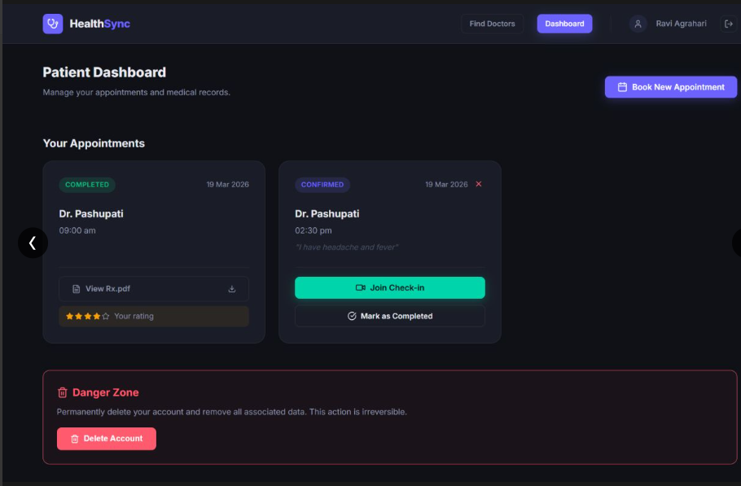
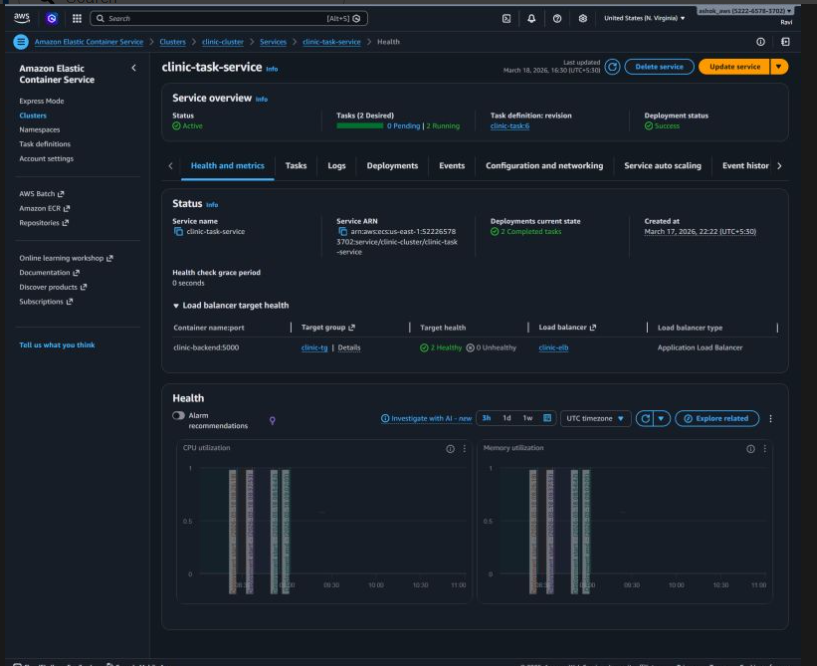

# 🏥 Cloud-Native Clinic Management System

<div align="center">
  
</div>
<div align="center">
  
</div>
<div align="center">
  
</div>

---

A highly scalable, production-ready **Telemedicine and Clinic Management Platform** engineered with a modern microservices-oriented architecture. It provides a seamless digital healthcare experience featuring role-based workflows, integrated video consultations, dynamically generated resilient PDF prescriptions, and an enterprise-grade cloud infrastructure deployed on AWS.

## 🌟 Key Engineering Highlights

- **Role-Based Access Control (RBAC)**: Tailored, secure experiences for `Patients` (scheduling, provider discovery, records) and `Doctors` (schedule management, teleconsult, Rx generation).
- **Embedded Telemedicine**: High-quality, real-time video consultations directly integrated within the dashboard securely powered by the **Jitsi Meet API**.
- **Automated Digital Prescriptions**: Doctors populate Rx data directly from the UI; the backend dynamically compiles a professional PDF (using `pdfkit`) and securely archives it natively to **AWS S3 Bucket** streams via `multer-s3`.
- **Multi-Channel Verification**: Reliable and instantaneous user validation utilizing **Email OTP (AWS SES / Nodemailer)** and **SMS notifications (AWS SNS)**.
- **Robust Security Posture**: Protected by strict stateless JWT-based session management, bcrypt password hashing (12 rounds), rigorous request sanitization via `express-validator`, and zero-trust HTTP header security through `Helmet.js`.

## 🏗️ Architecture & Technologies

The platform is strictly decoupled into a React frontend client and a RESTful backend API service to enable independent vertical and horizontal scaling.

| Layer | Technologies Leveraged |
|---|---|
| **Frontend SPA** | React 18, Vite, React Router v6, Axios Interceptors, Custom CSS (Dark Theme System) |
| **Backend API** | Node.js 20, Express.js |
| **Persistence (DB)** | MySQL 8 (Amazon RDS), Sequelize ORM v6 (Connection Pooling) |
| **Cloud Integration**| AWS S3 (Storage), AWS SES (Email), AWS SNS (SMS), AWS CloudFront, API Gateway, Elastic Load Balancer |
| **Containerization**| Docker, Docker Compose (Image optimized for AWS ECS / AWS Fargate) |
| **Video Integration**| Jitsi Iframe API |

## 📚 Technical Documentation

Explore the detailed system and engineering documentation to understand the architectural design patterns, user workflows, and codebase logic:

- [1️⃣ System Architecture & Cloud Setup](./docs/01-System-Architecture.md)
- [2️⃣ Core Workflows & User Journeys](./docs/02-Core-Workflows.md)
- [3️⃣ Backend API & Security Layer](./docs/03-Backend-and-API.md)
- [4️⃣ Frontend SPA & UI Engine](./docs/04-Frontend-and-UI.md)

*(Refer to the dedicated service-level READMEs at `frontend/README.md` and `backend/README.md` for specific low-level configuration details.)*

## 🚀 Getting Started (Local Development)

The repository consists of two main services that must run concurrently for full operation.

### 1. Prerequisites
- **Node.js 20+**
- **MySQL 8** (Local instance or Amazon RDS endpoint)
- **AWS Cloud Account** (IAM Credentials for S3, SES, SNS interactions)
- **Docker** (Optional, for containerized local networking)

### 2. Run the Backend API
Navigate to the backend service, install the exact dependency tree, and boot the server.
```bash
cd backend
npm install

# Configure your environment variables
cp .env.example .env 

npm run dev
```

### 3. Run the Frontend Web Application
Navigate to the frontend to launch the Vite HMR development server.
```bash
cd frontend
npm install

# Verify backend connectivity within .env (e.g. VITE_API_URL=http://localhost:5000/api/v1)
npm run dev
```

---
*Engineered to meet modern telemedicine requirements with advanced cloud resiliency and patient-doctor UX seamlessly integrated.*
